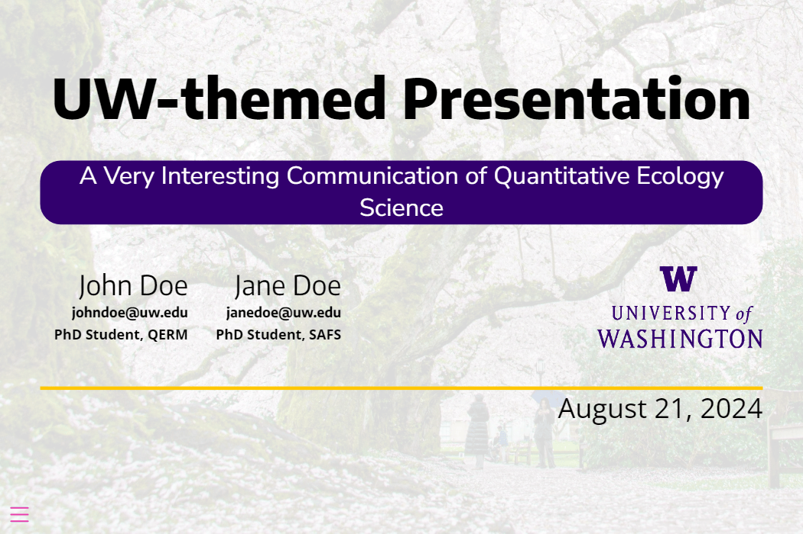

# UW-presentation

This repository contains a theme and template for making University of Washington
(UW) styled presentations slides using Quarto Reveal.js. This theme complies with 
[UW brand standards](https://www.washington.edu/brand/brand-elements/).
A preview of the theme is shown below.




## Installation and usage

To install and use the theme, navigate to your projects root directory and 
execute the following shell command:

```bash
quarto install extension cl-roberts/.templates/uw-presentation
```

This will create an `_extensions` subdirectory in your local file system which
contains this theme and any other quarto extension you may download. Then to use
the theme in a Reveal.js presentation simply add the following lines to your
`.qmd` file's YAML:

```yaml
format:
  uw-presentation-revealjs: default 
```

Alternatively, the following shell command

```bash
quarto use template cl-roberts/.templates/uw-presentation
```

will install the extension and create a template qmd file that you can use as a 
starting place for your presentation.

## Customization

If this theme does not meet your needs, I recommend customizing the `.scss` code
contained in `_extensions\uw-presentation\uw-presentation.scss`

## Example

Here is the source code for the template slide show: [template.qmd](template.qmd).
